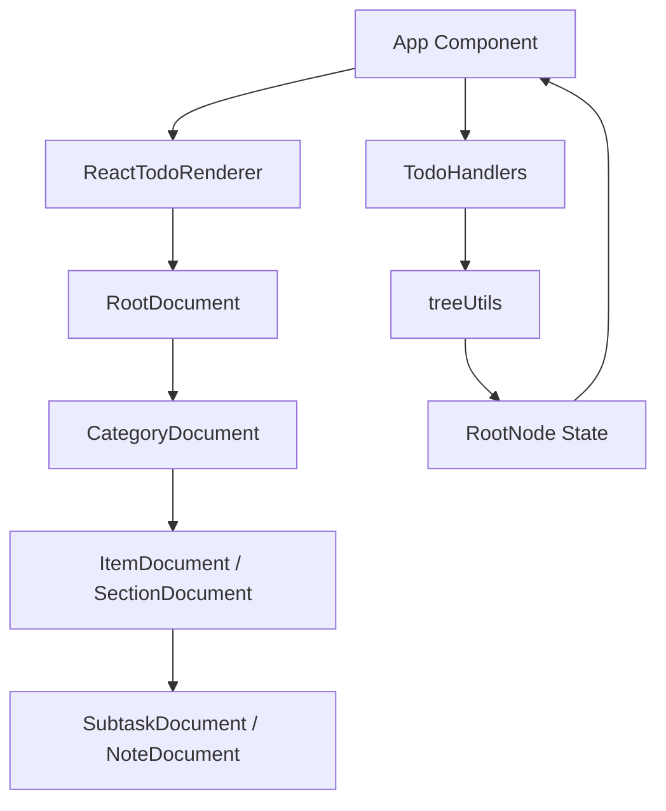
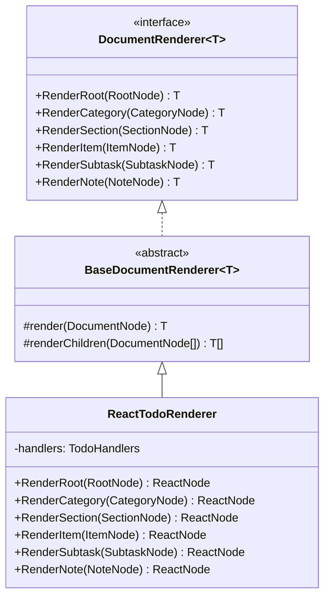
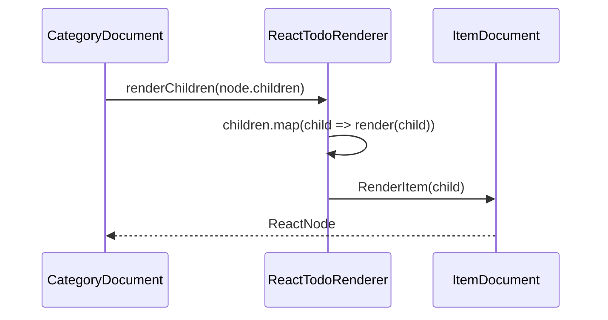
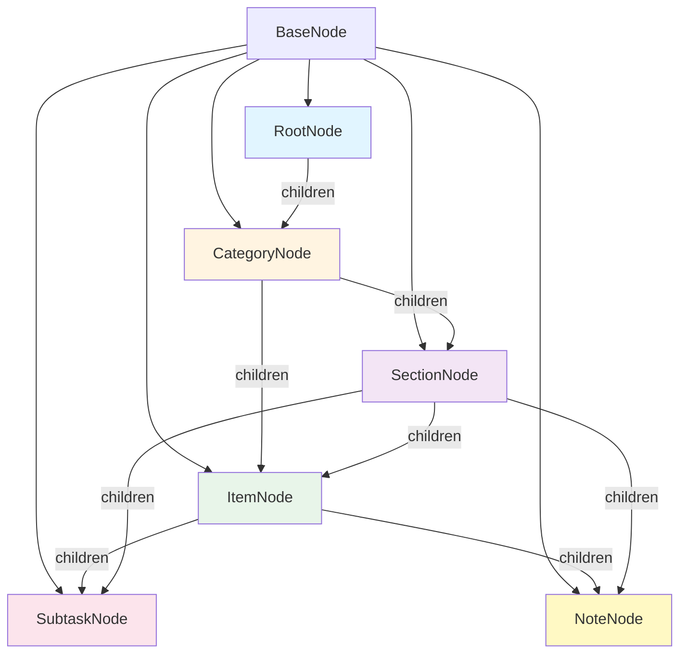
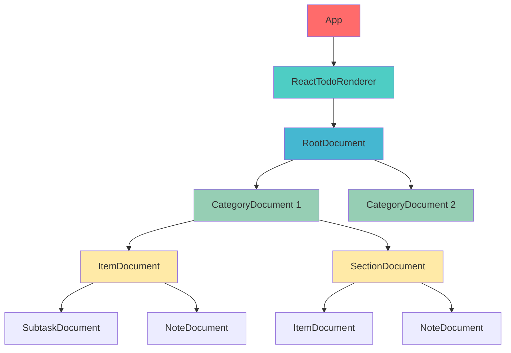
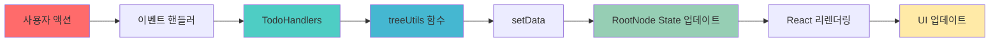
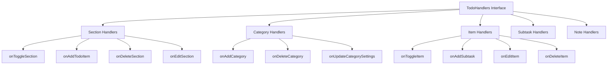
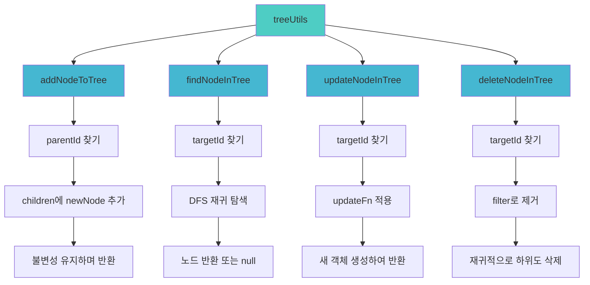
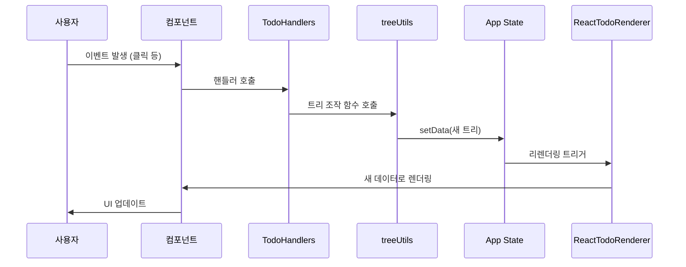
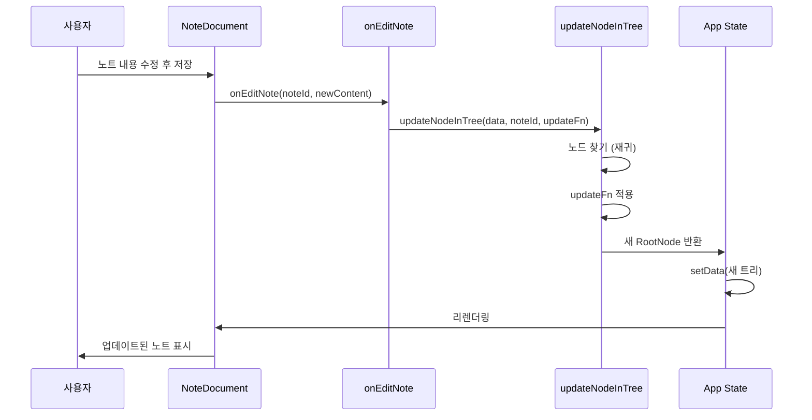

# Todo List 애플리케이션 아키텍처 문서

## 📋 목차

1. [프로젝트 개요](#프로젝트-개요)
2. [아키텍처 개요](#아키텍처-개요)
3. [디자인 패턴](#디자인-패턴)
4. [데이터 구조](#데이터-구조)
5. [컴포넌트 구조](#컴포넌트-구조)
6. [상태 관리](#상태-관리)
7. [트리 조작 함수](#트리-조작-함수)
8. [데이터 흐름](#데이터-흐름)

---

## 프로젝트 개요

### 기술 스택
- **Frontend**: React 19.2.0
- **Language**: TypeScript 5.9.3
- **Build Tool**: Webpack 5.102.1
- **Bundler**: Webpack Dev Server

### 주요 특징
- 중첩 가능한 트리 구조 Todo 리스트
- 타입 안전성을 위한 TypeScript 활용
- Visitor 패턴을 통한 렌더링 로직 분리
- 재귀적 컴포넌트 렌더링
- 불변성을 유지한 상태 관리

---

## 아키텍처 개요

이 애플리케이션은 **트리 구조 데이터**를 **재귀적 컴포넌트**로 렌더링하는 구조를 가지고 있습니다.



---

## 디자인 패턴

### 1. Visitor 패턴

노드 타입별 렌더링 로직을 분리하여 확장성을 높였습니다.



**장점**:
- 새로운 노드 타입 추가 시 확장 용이
- 렌더링 로직과 비즈니스 로직 분리
- 다양한 출력 타입 지원 가능 (제네릭 활용)

### 2. Monkey Component 패턴

부모 컴포넌트가 자식 렌더링 함수를 prop으로 받아 동적으로 렌더링합니다.



**특징**:
- `renderChildren` prop을 통해 자식 컴포넌트 동적 생성
- 컴포넌트 간 결합도 감소
- 재사용성 향상

---

## 데이터 구조

### 타입 계층 구조



### 타입 제약 조건

| 부모 타입 | 허용된 자식 타입 |
|---------|----------------|
| `RootNode` | `CategoryNode`만 |
| `CategoryNode` | `ItemNode`, `SectionNode` |
| `ItemNode` | `SubtaskNode`, `NoteNode` |
| `SectionNode` | `ItemNode`, `NoteNode`, `SubtaskNode` |
| `SubtaskNode` | 없음 (리프 노드) |
| `NoteNode` | 없음 (리프 노드) |

### 타입 정의

```typescript
// 기본 노드 인터페이스
interface BaseNode {
  type: string;
  id: string;
}

// Discriminated Union 타입
export type DocumentNode = 
  | RootNode 
  | CategoryNode 
  | SectionNode 
  | ItemNode 
  | SubtaskNode 
  | NoteNode;
```

---

## 컴포넌트 구조

### 컴포넌트 트리



### 컴포넌트 계층

```
App
└─ ReactTodoRenderer
   └─ RootDocument
      └─ CategoryDocument[]
         ├─ ItemDocument[]
         │  ├─ SubtaskDocument[]
         │  └─ NoteDocument[]
         └─ SectionDocument[]
            ├─ ItemDocument[]
            ├─ NoteDocument[]
            └─ SubtaskDocument[]
```

### 각 컴포넌트의 역할

| 컴포넌트 | 역할 | 주요 Props |
|---------|------|-----------|
| `RootDocument` | 최상위 컨테이너 | `node`, `onAddCategory`, `renderChildren` |
| `CategoryDocument` | 카테고리 표시 및 관리 | `node`, `onAddTodo`, `onAddSection`, `onSettings`, `onDelete`, `renderChildren` |
| `SectionDocument` | 섹션 표시 및 접기/펼치기 | `node`, `onToggleCollapse`, `onAddTodo`, `onEdit`, `onDelete`, `renderChildren` |
| `ItemDocument` | 할일 항목 표시 및 편집 | `node`, `onToggleComplete`, `onAddSubtask`, `onAddNote`, `onEdit`, `onDelete`, `renderChildren` |
| `SubtaskDocument` | 하위 작업 표시 | `node`, `onToggleComplete`, `onEdit`, `onDelete` |
| `NoteDocument` | 노트 표시 및 편집 | `node`, `onEdit`, `onDelete` |

---

## 상태 관리

### 상태 흐름도



### 상태 관리 특징

1. **단일 상태 소스 (Single Source of Truth)**
   - 전체 트리를 하나의 `RootNode` state로 관리
   - `useState<RootNode>` 사용

2. **불변성 유지 (Immutability)**
   - 상태를 직접 변경하지 않고 새 객체 생성
   - 스프레드 연산자(`...`) 활용

3. **함수형 업데이트**
   - `updateNodeInTree`에서 `updateFn`을 통한 선언적 상태 변경

### 핸들러 구조



---

## 트리 조작 함수

### CRUD 연산



### 함수별 상세

#### 1. addNodeToTree
- **목적**: 특정 부모 노드에 새 자식 노드 추가
- **알고리즘**: 재귀적 DFS 탐색
- **불변성**: 스프레드 연산자로 새 배열 생성

#### 2. findNodeInTree
- **목적**: ID로 노드 검색
- **알고리즘**: DFS (Depth-First Search)
- **반환**: 찾은 노드 또는 `null`

#### 3. updateNodeInTree
- **목적**: 특정 노드 업데이트
- **알고리즘**: 재귀적 탐색 + `updateFn` 적용
- **특징**: 함수형 업데이트 패턴

#### 4. deleteNodeInTree
- **목적**: 노드 삭제
- **알고리즘**: filter + 재귀적 삭제
- **특징**: 하위 노드도 함께 삭제

---

## 데이터 흐름

### 전체 데이터 흐름



### 예시: 노트 편집 흐름



---

## 파일 구조

```
document list/
├── interface/
│   ├── todo.ts          # 타입 정의
│   ├── Rander.ts        # Visitor 패턴 인터페이스
│   └── data.ts          # 초기 데이터
├── src/
│   ├── App.tsx          # 메인 컴포넌트 및 상태 관리
│   ├── App.css          # 스타일
│   ├── index.tsx        # 진입점
│   ├── components/
│   │   ├── RootDocument.tsx
│   │   ├── CategoryDocument.tsx
│   │   ├── SectionDocument.tsx
│   │   ├── ItemDocument.tsx
│   │   ├── SubtaskDocument.tsx
│   │   ├── NoteDocument.tsx
│   │   └── index.ts
│   └── utils/
│       └── treeUtils.ts  # 트리 조작 함수
├── public/
│   └── index.html
├── package.json
├── tsconfig.json
└── webpack.config.js
```

---

## 주요 설계 결정

### 1. Visitor 패턴 선택 이유
- 노드 타입별 렌더링 로직 분리
- 새로운 노드 타입 추가 시 확장 용이
- 렌더링 로직과 비즈니스 로직 분리

### 2. 단일 상태 관리
- 전체 트리를 하나의 state로 관리하여 단순성 유지
- 불변성을 통한 예측 가능한 상태 변경

### 3. 재귀적 렌더링
- `renderChildren` prop을 통한 동적 자식 렌더링
- 트리 깊이에 제한 없이 중첩 가능

### 4. TypeScript 타입 시스템
- Discriminated Union으로 타입 안전성 확보
- 컴파일 타임 타입 체크

---

## 성능 고려사항

### 현재 구조의 특징
- 노드 변경 시 전체 트리 리렌더링 발생
- 각 컴포넌트가 독립적인 호버 상태 관리

### 개선 가능한 부분
- `React.memo`를 통한 컴포넌트 메모이제이션
- `useCallback`을 통한 핸들러 메모이제이션
- Context API를 통한 상태 관리 분리

---

## 확장 가능성

### 새로운 노드 타입 추가 시
1. `interface/todo.ts`에 새 타입 정의
2. `BaseDocumentRenderer`에 새 `Render*` 메서드 추가
3. `ReactTodoRenderer`에 구현 추가
4. 새 컴포넌트 생성
5. 타입 제약 조건 업데이트

### 새로운 렌더러 추가 시
- `BaseDocumentRenderer<T>`를 상속받아 새 렌더러 클래스 생성
- 예: `PDFRenderer`, `MarkdownRenderer` 등

---

## 참고사항

- 모든 트리 조작 함수는 불변성을 유지합니다
- 타입 제약 조건은 `interface/todo.ts`에 정의되어 있습니다
- 핸들러는 `App.tsx`에서 중앙 관리됩니다
- 각 컴포넌트는 독립적인 로컬 상태(편집 모드, 호버 상태)를 가집니다

